# Bodhi Form Validations

A comprehensive, modern form validation library with TypeScript support. Provides extensive validation rules for forms, with customizable options and detailed error messages.

[](https://badge.fury.io/js/bodhi-form-validations)
[](https://github.com/ellerbrock/typescript-badges/)
[](https://opensource.org/licenses/MIT)

## Table of Contents
- [Features](#features)
- [Installation](#installation)
- [Usage](#usage)
  - [TypeScript Usage](#typescript-usage)
  - [JavaScript Usage](#javascript-usage)
  - [React Usage](#react-usage)
  - [Vue.js Usage](#vuejs-usage)
- [API Reference](#api-reference)
- [Advanced Examples](#advanced-examples)
- [Error Handling](#error-handling)
- [Best Practices](#best-practices)
- [Development](#development)
- [Contributing](#contributing)
- [License](#license)
- [Framework Integration Guides](#framework-integration-guides)
- [Common Patterns and Best Practices](#common-patterns-and-best-practices)

## Features

- 🚀 Full TypeScript support with type definitions and interfaces
- 📝 Comprehensive validation rules for common form fields
- ⚙️ Highly customizable options for each validation type
- 🌍 International support for phone numbers and postal codes
- 💪 Zero dependencies - lightweight and efficient
- 📱 Browser and Node.js compatible
- 🔒 Strong password validation with strength indicators
- 🌐 Multiple country formats support
- 🔄 Async validation support
- 📋 Detailed error messages in multiple languages
- ⚡ Fast and efficient validation algorithms
- 🧪 Well-tested with high coverage

## Validation Types

### Validation Types Overview Table

| Category | Validation Type | Function Name | Description | Options |
|----------|----------------|---------------|-------------|----------|
| **User Input** | Username | `isUsername` | Validates usernames | `minLength`, `maxLength`, `allowSpecialChars` |
| | Email | `isEmail` | Validates email addresses | `allowInternational`, `strictDomain` |
| | Password | `isStrongPassword` | Validates password strength | `minLength`, `requireUppercase`, `requireNumbers`, `requireSpecialChars` |
| | Phone | `isPhone` | Validates phone numbers | `country`, `requireCountryCode`, `allowSpaces` |
| **Numbers** | Number | `isNumber` | Validates numeric values | `min`, `max`, `allowDecimals`, `precision` |
| | Integer | `isInteger` | Validates whole numbers | `min`, `max`, `allowNegative` |
| | Float | `isFloat` | Validates decimal numbers | `min`, `max`, `precision`, `allowScientific` |
| **Arrays** | Array | `isArray` | Validates arrays | `minLength`, `maxLength`, `unique`, `sortOrder` |
| | Matrix | `isMatrix` | Validates 2D arrays | `dimensions`, `allowJagged` |
| **Objects** | Object | `isObject` | Validates objects | `requiredFields`, `optionalFields`, `strict` |
| | Schema | `isSchema` | Validates against schema | `schema`, `strict`, `additionalProps` |
| **Dates** | Date | `isDate` | Validates dates | `format`, `min`, `max` |
| | DateRange | `isDateRange` | Validates date ranges | `minRange`, `maxRange`, `allowWeekends` |
| | Age | `isAge` | Validates age | `minAge`, `maxAge`, `referenceDate` |
| **Files** | File | `isFile` | Validates files | `maxSize`, `allowedTypes`, `maxDimensions` |
| | Image | `isImage` | Validates images | `maxSize`, `allowedFormats`, `dimensions` |
| | Document | `isDocument` | Validates documents | `maxSize`, `allowedTypes` |
| **Address** | Address | `isAddress` | Validates addresses | `requireStreet`, `requireCity`, `requireZip` |
| | PostalCode | `isPostalCode` | Validates postal codes | `country`, `format` |
| **Financial** | Currency | `isCurrency` | Validates currency amounts | `currency`, `decimals`, `symbol` |
| | CreditCard | `isCreditCard` | Validates credit cards | `type`, `validateCVV` |
| **Colors** | Color | `isColor` | Validates color codes | `format`, `allowAlpha` |
| **Network** | URL | `isURL` | Validates URLs | `protocols`, `requireProtocol` |
| | IP | `isIPAddress` | Validates IP addresses | `version`, `allowPrivate` |
| **Time** | Time | `isTime` | Validates time | `format`, `allowSeconds` |
| | TimeZone | `isTimeZone` | Validates timezones | `format`, `allowUTC` |
| **Documents** | SSN | `isSSN` | Validates SSNs | `format`, `allowMasked` |
| | Passport | `isPassport` | Validates passport numbers | `country`, `format` |

### Validation Types Diagram

```mermaid
graph TD
    A[Bodhi Form Validation] --> B[User Input]
    A --> C[Numbers]
    A --> D[Arrays]
    A --> E[Objects]
    A --> F[Dates]
    A --> G[Files]
    A --> H[Address]
    A --> I[Financial]
    A --> J[Colors]
    A --> K[Network]
    A --> L[Time]
    A --> M[Documents]

    B --> B1[Username]
    B --> B2[Email]
    B --> B3[Password]
    B --> B4[Phone]

    C --> C1[Number]
    C --> C2[Integer]
    C --> C3[Float]

    D --> D1[Array]
    D --> D2[Matrix]

    E --> E1[Object]
    E --> E2[Schema]

    F --> F1[Date]
    F --> F2[DateRange]
    F --> F3[Age]

    G --> G1[File]
    G --> G2[Image]
    G --> G3[Document]

    H --> H1[Address]
    H --> H2[PostalCode]

    I --> I1[Currency]
    I --> I2[CreditCard]

    J --> J1[Color]

    K --> K1[URL]
    K --> K2[IP]

    L --> L1[Time]
    L --> L2[TimeZone]

    M --> M1[SSN]
    M --> M2[Passport]

    classDef category fill:#f9f,stroke:#333,stroke-width:2px;
    classDef type fill:#bbf,stroke:#333,stroke-width:1px;
    
    class A,B,C,D,E,F,G,H,I,J,K,L,M category;
    class B1,B2,B3,B4,C1,C2,C3,D1,D2,E1,E2,F1,F2,F3,G1,G2,G3,H1,H2,I1,I2,J1,K1,K2,L1,L2,M1,M2 type;
```



### Quick Reference Examples

```typescript
// User Input Validations
const usernameValid = validate.isUsername('john_doe', { minLength: 3, maxLength: 20 });
const emailValid = validate.isEmail('user@example.com', { allowInternational: true });
const passwordValid = validate.isStrongPassword('P@ssw0rd123', { minLength: 8 });
const phoneValid = validate.isPhone('+1-555-123-4567', { country: 'US' });

// Number Validations
const numberValid = validate.isNumber('123.45', { min: 0, max: 1000 });
const integerValid = validate.isInteger('42', { allowNegative: false });
const floatValid = validate.isFloat('3.14159', { precision: 5 });

// Array Validations
const arrayValid = validate.isArray(['a', 'b', 'c'], { unique: true });
const matrixValid = validate.isMatrix([[1, 2], [3, 4]], { dimensions: [2, 2] });

// Date Validations
const dateValid = validate.isDate('2025-01-24', { format: 'YYYY-MM-DD' });
const ageValid = validate.isAge('1990-01-01', { minAge: 18 });

// File Validations
const fileValid = validate.isFile(fileObject, { maxSize: '10MB' });
const imageValid = validate.isImage(imageFile, { maxDimensions: [1920, 1080] });

// Address Validations
const addressValid = validate.isAddress({
    street: '123 Main St',
    city: 'San Francisco',
    zip: '94105'
});

// Financial Validations
const currencyValid = validate.isCurrency('$1,234.56', { currency: 'USD' });
const creditCardValid = validate.isCreditCard('4111111111111111', { type: 'visa' });

// Network Validations
const urlValid = validate.isURL('https://example.com', { requireProtocol: true });
const ipValid = validate.isIPAddress('192.168.1.1', { version: 'v4' });
```

## Detailed Validation Examples

### User Input Validation

#### Username Validation
```typescript
import validate from 'bodhi-form-validations';

// Basic username validation
const basicUsername = validate.isUsername('john_doe');
console.log(basicUsername.isValid); // true

// Advanced username validation
const advancedUsername = validate.isUsername('john.doe@123', {
  minLength: 5,
  maxLength: 20,
  allowSpecialChars: true,
  allowedChars: 'a-zA-Z0-9._@',
  bannedUsernames: ['admin', 'root'],
  caseSensitive: false
});

if (!advancedUsername.isValid) {
  console.error(advancedUsername.message);
}
```

#### Email Validation
```typescript
// Basic email validation
const basicEmail = validate.isEmail('user@example.com');

// Advanced email validation
const advancedEmail = validate.isEmail('user.name+tag@subdomain.example.co.uk', {
  allowInternational: true,
  strictDomain: true,
  allowPlusAddressing: true,
  bannedDomains: ['tempmail.com'],
  validateMX: true
});

// Custom domain validation
const workEmail = validate.isEmail('john@company.com', {
  allowedDomains: ['company.com', 'company.org'],
  errorMessage: 'Please use your company email'
});
```

#### Password Validation
```typescript
// Basic password validation
const basicPassword = validate.isStrongPassword('MyP@ssw0rd');

// Advanced password strength validation
const advancedPassword = validate.isStrongPassword('MySecureP@ssw0rd123', {
  minLength: 12,
  maxLength: 64,
  requireUppercase: true,
  requireLowercase: true,
  requireNumbers: true,
  requireSpecialChars: true,
  minUniqueChars: 8,
  maxRepeatingChars: 2,
  bannedPasswords: ['Password123!', 'Admin123!'],
  customRegex: /^(?=.*[!@#$%^&*])/,
  errorMessages: {
    tooShort: 'Password must be at least 12 characters',
    noUppercase: 'Include at least one uppercase letter',
    noSpecialChar: 'Include at least one special character'
  }
});

// Password strength indicator
if (advancedPassword.isValid) {
  console.log(`Password strength: ${advancedPassword.strength}/4`);
  console.log(`Suggestions: ${advancedPassword.suggestions.join(', ')}`);
}
```

#### Phone Number Validation
```typescript
// Basic phone validation
const basicPhone = validate.isPhone('555-123-4567');

// International phone validation
const usPhone = validate.isPhone('+1 (555) 123-4567', {
  country: 'US',
  requireCountryCode: true,
  allowSpaces: true,
  allowHyphens: true,
  allowParentheses: true
});

const ukPhone = validate.isPhone('+44 20 7123 4567', {
  country: 'UK',
  format: 'international'
});

const indianPhone = validate.isPhone('+91 98765-43210', {
  country: 'IN',
  mobileOnly: true
});
```

### Number Validation

#### Basic Number Validation
```typescript
// Integer validation
const integerCheck = validate.isNumber('42', {
  integer: true,
  min: 0,
  max: 100
});

// Decimal validation
const decimalCheck = validate.isNumber('3.14159', {
  allowDecimals: true,
  precision: 5,
  min: 0,
  max: 10
});

// Scientific notation
const scientificCheck = validate.isNumber('1.23e-4', {
  allowScientific: true,
  allowNegative: true
});
```

#### Currency and Financial Validation
```typescript
// Basic currency validation
const basicCurrency = validate.isCurrency('$1,234.56');

// Advanced currency validation
const advancedCurrency = validate.isCurrency('€1.234,56', {
  currency: 'EUR',
  locale: 'de-DE',
  allowNegative: false,
  requireSymbol: true,
  symbolPosition: 'prefix'
});

// Custom format
const customCurrency = validate.isCurrency('1,234.56 USD', {
  format: '0,0.00 CCC',
  decimals: 2,
  thousandsSeparator: ',',
  decimalSeparator: '.'
});
```

### Date and Time Validation

#### Date Validation
```typescript
// Basic date validation
const basicDate = validate.isDate('2025-01-24');

// Advanced date validation
const advancedDate = validate.isDate('24/01/2025', {
  format: 'DD/MM/YYYY',
  min: '2024-01-01',
  max: '2025-12-31',
  allowWeekends: false,
  allowHolidays: false
});

// Age validation
const ageCheck = validate.isAge('1990-01-01', {
  minAge: 18,
  maxAge: 100,
  referenceDate: '2025-01-24'
});

// Date range validation
const dateRange = validate.isDateRange({
  start: '2025-01-01',
  end: '2025-12-31'
}, {
  minRange: '1 month',
  maxRange: '1 year',
  allowWeekends: true
});
```

### Array and Object Validation

#### Array Validation
```typescript
// Basic array validation
const basicArray = validate.isArray(['a', 'b', 'c'], {
  minLength: 1,
  maxLength: 5
});

// Advanced array validation
const advancedArray = validate.isArray([1, 2, 3, 4, 5], {
  unique: true,
  sortOrder: 'ascending',
  type: 'number',
  itemValidator: (item) => item > 0 && item < 10
});

// Matrix validation
const matrixCheck = validate.isMatrix([
  [1, 2, 3],
  [4, 5, 6],
  [7, 8, 9]
], {
  dimensions: [3, 3],
  allowJagged: false,
  itemValidator: (item) => Number.isInteger(item)
});
```

#### Object Validation
```typescript
// Basic object validation
const basicObject = validate.isObject({
  name: 'John',
  age: 30
}, {
  requiredFields: ['name', 'age']
});

// Advanced object validation
const advancedObject = validate.isObject({
  username: 'john_doe',
  email: 'john@example.com',
  settings: {
    theme: 'dark',
    notifications: true
  }
}, {
  schema: {
    username: { type: 'string', required: true },
    email: { type: 'email', required: true },
    settings: {
      type: 'object',
      properties: {
        theme: { type: 'string', enum: ['light', 'dark'] },
        notifications: { type: 'boolean' }
      }
    }
  },
  strict: true,
  additionalProperties: false
});
```

### File Validation

#### File Upload Validation
```typescript
// Basic file validation
const basicFile = validate.isFile(fileObject, {
  maxSize: '10MB',
  allowedTypes: ['pdf', 'doc', 'docx']
});

// Image file validation
const imageFile = validate.isImage(imageObject, {
  maxSize: '5MB',
  allowedTypes: ['jpg', 'png', 'gif'],
  maxDimensions: [1920, 1080],
  minDimensions: [100, 100],
  aspectRatio: '16:9'
});

// Document validation
const documentFile = validate.isDocument(docObject, {
  maxSize: '20MB',
  allowedTypes: ['pdf', 'doc', 'docx', 'xls', 'xlsx'],
  allowPassword: false,
  validateContent: true
});
```

### Network Validation

#### URL Validation
```typescript
// Basic URL validation
const basicUrl = validate.isURL('https://example.com');

// Advanced URL validation
const advancedUrl = validate.isURL('https://api.example.com/data?id=123', {
  protocols: ['https'],
  requireProtocol: true,
  allowQueryParams: true,
  allowFragments: false,
  allowedDomains: ['example.com', 'api.example.com'],
  validateDNS: true
});
```

#### IP Address Validation
```typescript
// IPv4 validation
const ipv4 = validate.isIPAddress('192.168.1.1', {
  version: 'v4',
  allowPrivate: true,
  allowLoopback: false
});

// IPv6 validation
const ipv6 = validate.isIPAddress('2001:0db8:85a3:0000:0000:8a2e:0370:7334', {
  version: 'v6',
  allowCompressed: true,
  allowIPv4Mapped: false
});
```

### Complete Form Validation Example
```typescript
interface UserForm {
  username: string;
  email: string;
  password: string;
  age: number;
  phone: string;
  address: {
    street: string;
    city: string;
    zip: string;
  };
  preferences: string[];
}

const validateUserForm = (form: UserForm) => {
  const validations = {
    username: validate.isUsername(form.username, {
      minLength: 3,
      maxLength: 20
    }),
    email: validate.isEmail(form.email),
    password: validate.isStrongPassword(form.password),
    age: validate.isNumber(form.age, {
      min: 18,
      max: 120,
      integer: true
    }),
    phone: validate.isPhone(form.phone, {
      country: 'US',
      requireCountryCode: true
    }),
    address: validate.isObject(form.address, {
      requiredFields: ['street', 'city', 'zip'],
      schema: {
        street: { type: 'string', minLength: 5 },
        city: { type: 'string' },
        zip: { type: 'string', pattern: '\\d{5}' }
      }
    }),
    preferences: validate.isArray(form.preferences, {
      minLength: 1,
      maxLength: 5,
      unique: true
    })
  };

  const errors: Record<string, string> = {};
  let isValid = true;

  Object.entries(validations).forEach(([field, result]) => {
    if (!result.isValid) {
      errors[field] = result.message;
      isValid = false;
    }
  });

  return {
    isValid,
    errors,
    validatedData: isValid ? form : null
  };
};

// Usage example
const formData: UserForm = {
  username: 'john_doe',
  email: 'john@example.com',
  password: 'SecureP@ss123',
  age: 25,
  phone: '+1-555-123-4567',
  address: {
    street: '123 Main St',
    city: 'San Francisco',
    zip: '94105'
  },
  preferences: ['dark_theme', 'notifications_on']
};

const validationResult = validateUserForm(formData);
if (validationResult.isValid) {
  console.log('Form is valid!', validationResult.validatedData);
} else {
  console.error('Form validation failed:', validationResult.errors);
}
```

## Installation

Install using npm:
```bash
npm install bodhi-form-validations
```

Install using yarn:
```bash
yarn add bodhi-form-validations
```

Install using pnpm:
```bash
pnpm add bodhi-form-validations
```

## Usage

### TypeScript Usage

The library provides full TypeScript support with type definitions. Here's how to use it in a TypeScript project:

```typescript
import validate from 'bodhi-form-validations';

// Basic usage
const emailResult = validate.isEmail('user@example.com');
console.log(emailResult.isValid); // true
console.log(emailResult.message); // "Valid email"

// With options
const passwordResult = validate.isStrongPassword('MyPassword123!', {
  minLength: 10,
  requireUppercase: true,
  requireNumbers: true,
  requireSpecialChars: true
});

// Using type definitions
interface UserForm {
  username: string;
  email: string;
  age: number;
  birthDate: Date;
}

const validateUserForm = (form: UserForm) => {
  const validations = {
    username: validate.isUsername(form.username, {
      minLength: 3,
      maxLength: 20,
      allowSpecialChars: false
    }),
    email: validate.isEmail(form.email),
    age: validate.isNumber(form.age, {
      min: 18,
      max: 120,
      integer: true
    }),
    birthDate: validate.isDateInRange(form.birthDate, {
      minAge: 18,
      maxAge: 120
    })
  };

  return Object.entries(validations).reduce((errors, [field, result]) => {
    if (!result.isValid) {
      errors[field] = result.message;
    }
    return errors;
  }, {} as Record<string, string>);
};
```

### JavaScript Usage

In JavaScript projects, you can use the library with CommonJS or ES Modules:

```javascript
// ES Modules
import validate from 'bodhi-form-validations';

// CommonJS
const validate = require('bodhi-form-validations');

// Basic form validation
const form = {
  username: 'johndoe',
  email: 'john@example.com',
  phone: '+1-555-123-4567',
  address: {
    street: '123 Main St',
    city: 'San Francisco',
    zip: '94105'
  }
};

const validateForm = (formData) => {
  const errors = {};
  
  // Username validation
  const usernameResult = validate.isUsername(formData.username);
  if (!usernameResult.isValid) {
    errors.username = usernameResult.message;
  }
  
  // Email validation
  const emailResult = validate.isEmail(formData.email);
  if (!emailResult.isValid) {
    errors.email = emailResult.message;
  }
  
  // Phone validation
  const phoneResult = validate.isPhone(formData.phone);
  if (!phoneResult.isValid) {
    errors.phone = phoneResult.message;
  }
  
  // Address validation
  const addressResult = validate.isAddress(formData.address, {
    requireStreet: true,
    requireCity: true,
    requireZip: true
  });
  if (!addressResult.isValid) {
    errors.address = addressResult.message;
  }
  
  return {
    isValid: Object.keys(errors).length === 0,
    errors
  };
};

// Usage
const validation = validateForm(form);
if (!validation.isValid) {
  console.error('Form validation failed:', validation.errors);
}
```

### React Usage

Example of using the library in a React component:

```typescript
import React, { useState } from 'react';
import validate from 'bodhi-form-validations';

interface FormData {
  username: string;
  email: string;
  password: string;
}

const RegistrationForm: React.FC = () => {
  const [formData, setFormData] = useState<FormData>({
    username: '',
    email: '',
    password: ''
  });
  const [errors, setErrors] = useState<Partial<Record<keyof FormData, string>>>({});

  const handleChange = (e: React.ChangeEvent<HTMLInputElement>) => {
    const { name, value } = e.target;
    setFormData(prev => ({ ...prev, [name]: value }));
    
    // Real-time validation
    let validationResult;
    switch (name) {
      case 'username':
        validationResult = validate.isUsername(value);
        break;
      case 'email':
        validationResult = validate.isEmail(value);
        break;
      case 'password':
        validationResult = validate.isStrongPassword(value);
        break;
    }
    
    setErrors(prev => ({
      ...prev,
      [name]: validationResult.isValid ? '' : validationResult.message
    }));
  };

  const handleSubmit = (e: React.FormEvent) => {
    e.preventDefault();
    // Final validation before submission
    const validations = {
      username: validate.isUsername(formData.username),
      email: validate.isEmail(formData.email),
      password: validate.isStrongPassword(formData.password)
    };

    const newErrors = Object.entries(validations).reduce((acc, [field, result]) => {
      if (!result.isValid) {
        acc[field] = result.message;
      }
      return acc;
    }, {});

    if (Object.keys(newErrors).length === 0) {
      // Form is valid, proceed with submission
      console.log('Form submitted:', formData);
    } else {
      setErrors(newErrors);
    }
  };

  return (
    <form onSubmit={handleSubmit}>
      <div>
        <input
          type="text"
          name="username"
          value={formData.username}
          onChange={handleChange}
          placeholder="Username"
        />
        {errors.username && <span className="error">{errors.username}</span>}
      </div>
      <div>
        <input
          type="email"
          name="email"
          value={formData.email}
          onChange={handleChange}
          placeholder="Email"
        />
        {errors.email && <span className="error">{errors.email}</span>}
      </div>
      <div>
        <input
          type="password"
          name="password"
          value={formData.password}
          onChange={handleChange}
          placeholder="Password"
        />
        {errors.password && <span className="error">{errors.password}</span>}
      </div>
      <button type="submit">Register</button>
    </form>
  );
};

export default RegistrationForm;
```

### Vue.js Usage

Example of using the library in a Vue.js component:

```vue
<template>
  <form @submit.prevent="handleSubmit">
    <div>
      <input
        v-model="formData.username"
        @input="validateField('username')"
        placeholder="Username"
      />
      <span v-if="errors.username" class="error">{{ errors.username }}</span>
    </div>
    <div>
      <input
        v-model="formData.email"
        @input="validateField('email')"
        placeholder="Email"
      />
      <span v-if="errors.email" class="error">{{ errors.email }}</span>
    </div>
    <div>
      <input
        v-model="formData.password"
        type="password"
        @input="validateField('password')"
        placeholder="Password"
      />
      <span v-if="errors.password" class="error">{{ errors.password }}</span>
    </div>
    <button type="submit">Register</button>
  </form>
</template>

<script>
import validate from 'bodhi-form-validations';

export default {
  data() {
    return {
      formData: {
        username: '',
        email: '',
        password: ''
      },
      errors: {}
    };
  },
  methods: {
    validateField(fieldName) {
      let validationResult;
      
      switch (fieldName) {
        case 'username':
          validationResult = validate.isUsername(this.formData.username);
          break;
        case 'email':
          validationResult = validate.isEmail(this.formData.email);
          break;
        case 'password':
          validationResult = validate.isStrongPassword(this.formData.password);
          break;
      }
      
      this.$set(this.errors, fieldName, 
        validationResult.isValid ? '' : validationResult.message
      );
    },
    handleSubmit() {
      // Validate all fields
      Object.keys(this.formData).forEach(this.validateField);
      
      // Check if there are any errors
      if (!Object.values(this.errors).some(error => error)) {
        // Form is valid, proceed with submission
        console.log('Form submitted:', this.formData);
      }
    }
  }
};
</script>
```

### Advanced Examples

#### Custom Password Validation Rules

```typescript
const passwordResult = validate.isStrongPassword('MyPassword123!', {
  minLength: 10,
  maxLength: 50,
  requireUppercase: true,
  requireLowercase: true,
  requireNumbers: true,
  requireSpecialChars: true,
  allowSpaces: false,
  minStrength: 4
});

if (passwordResult.isValid) {
  console.log(`Password strength: ${passwordResult.strength}/4`);
} else {
  console.log(`Password error: ${passwordResult.message}`);
}
```

#### International Phone Number Validation

```typescript
// US phone number
const usPhone = validate.isPhone('(555) 123-4567', {
  country: 'US',
  allowSpaces: true
});

// UK phone number with country code
const ukPhone = validate.isPhone('+44 20 7123 4567', {
  country: 'UK',
  requireCountryCode: true
});

// Indian phone number
const inPhone = validate.isPhone('+91 98765 43210', {
  country: 'IN',
  allowSpaces: true
});
```

#### URL Validation with Custom Rules

```typescript
// HTTPS only URL
const secureUrl = validate.isURL('https://example.com', {
  requireProtocol: true,
  allowedProtocols: ['https:']
});

// URL without query parameters
const cleanUrl = validate.isURL('https://api.example.com/data', {
  allowQueryParams: false,
  allowFragments: false
});
```

## API Reference

### File Validation
```typescript
validate.isFile(file: File, options?: {
  maxSize?: number;         // default: 5MB
  allowedTypes?: string[];  // e.g., ['image/jpeg', 'image/png']
  minWidth?: number;        // for images
  minHeight?: number;       // for images
  maxWidth?: number;        // for images
  maxHeight?: number;       // for images
  aspectRatio?: number;     // width/height
})
```

### Address Validation
```typescript
validate.isAddress(address: {
  street: string;
  city: string;
  state: string;
  zip: string;
  country: string;
}, options?: {
  requireStreet?: boolean;  // default: true
  requireCity?: boolean;    // default: true
  requireState?: boolean;   // default: true
  requireZip?: boolean;     // default: true
  requireCountry?: boolean; // default: true
  allowPOBox?: boolean;     // default: true
})
```

### Money/Currency Validation
```typescript
validate.isMoney(amount: string | number, options?: {
  currency?: string;        // default: 'USD'
  minAmount?: number;       // default: 0
  maxAmount?: number;       // default: Number.MAX_SAFE_INTEGER
  allowNegative?: boolean;  // default: false
  decimals?: number;        // default: 2
})
```

### Color Validation
```typescript
validate.isColor(color: string, options?: {
  format?: 'hex' | 'rgb' | 'rgba' | 'hsl' | 'any'; // default: 'any'
  allowAlpha?: boolean;     // default: true
})
```

### IP Address Validation
```typescript
validate.isIPAddress(ip: string, options?: {
  version?: 'v4' | 'v6' | 'any';  // default: 'any'
  allowPrivate?: boolean;         // default: true
  allowReserved?: boolean;        // default: false
})
```

### Social Security Number (SSN) Validation
```typescript
validate.isSSN(ssn: string, options?: {
  country?: 'US' | 'CA';           // default: 'US'
  format?: 'masked' | 'unmasked';  // default: 'masked'
})
```

### Time Validation
```typescript
validate.isTime(time: string, options?: {
  format?: '12h' | '24h';    // default: '24h'
  allowSeconds?: boolean;     // default: true
  minTime?: string;          // optional
  maxTime?: string;          // optional
})
```

### Geographic Coordinates Validation
```typescript
validate.isLatLng(coords: { 
  lat: number; 
  lng: number 
}, options?: {
  precision?: number;                // default: 6
  format?: 'decimal' | 'dms';        // default: 'decimal'
})
```

## Advanced Examples

#### Custom Password Validation Rules

```typescript
const passwordResult = validate.isStrongPassword('MyPassword123!', {
  minLength: 10,
  maxLength: 50,
  requireUppercase: true,
  requireLowercase: true,
  requireNumbers: true,
  requireSpecialChars: true,
  allowSpaces: false,
  minStrength: 4
});

if (passwordResult.isValid) {
  console.log(`Password strength: ${passwordResult.strength}/4`);
} else {
  console.log(`Password error: ${passwordResult.message}`);
}
```

#### International Phone Number Validation

```typescript
// US phone number
const usPhone = validate.isPhone('(555) 123-4567', {
  country: 'US',
  allowSpaces: true
});

// UK phone number with country code
const ukPhone = validate.isPhone('+44 20 7123 4567', {
  country: 'UK',
  requireCountryCode: true
});

// Indian phone number
const inPhone = validate.isPhone('+91 98765 43210', {
  country: 'IN',
  allowSpaces: true
});
```

#### URL Validation with Custom Rules

```typescript
// HTTPS only URL
const secureUrl = validate.isURL('https://example.com', {
  requireProtocol: true,
  allowedProtocols: ['https:']
});

// URL without query parameters
const cleanUrl = validate.isURL('https://api.example.com/data', {
  allowQueryParams: false,
  allowFragments: false
});
```

## Error Handling

The library provides detailed error messages for each validation failure:

```typescript
const validations = {
  weakPassword: validate.isStrongPassword('weak', {
    minLength: 8,
    requireSymbols: true
  }),
  invalidEmail: validate.isEmail('invalid@email'),
  invalidPhone: validate.isPhone('123', { country: 'US' })
};

// Handle errors
Object.entries(validations).forEach(([field, result]) => {
  if (!result.isValid) {
    console.log(`${field} error: ${result.message}`);
  }
});
```

## TypeScript Support

The library includes comprehensive TypeScript definitions:

```typescript
import validate, { 
  ValidationResult,
  PasswordOptions,
  EmailOptions,
  PhoneOptions
} from 'bodhi-form-validations';

// Type-safe options
const passwordOptions: PasswordOptions = {
  minLength: 8,
  requireSymbols: true
};

// Type-safe result
const result: ValidationResult = validate.isPassword('password123', passwordOptions);
```

## Development

### Prerequisites
- Node.js (>= 14.x)
- npm or yarn or pnpm

### Local Development
1. Clone the repository:
```bash
git clone https://github.com/BODHEESH/bodhi-form-validation.git
cd bodhi-form-validation
```

2. Install dependencies:
```bash
npm install
```

3. Build the package:
```bash
npm run build
```

4. Run tests:
```bash
npm test
```

### Building for Production

The package uses TypeScript for development and outputs both CommonJS and ES Modules:

```bash
# Build once
npm run build

# Build in watch mode
npm run build:watch
```

Build outputs:
- `dist/index.js` - CommonJS module
- `dist/index.d.ts` - TypeScript declarations
- `dist/index.esm.js` - ES Module

### Running Tests

The package includes comprehensive tests:

```bash
# Run all tests
npm test

# Run tests in watch mode
npm test:watch

# Run tests with coverage
npm test:coverage
```

### Code Quality

We maintain high code quality standards:

```bash
# Run linter
npm run lint

# Fix linting issues
npm run lint:fix

# Format code
npm run format
```

### Publishing

To publish a new version:

1. Update version in package.json:
```bash
npm version patch  # for bug fixes
npm version minor  # for new features
npm version major  # for breaking changes
```

2. Build and test:
```bash
npm run build
npm test
```

3. Publish to npm:
```bash
npm login
npm publish
```

## Troubleshooting

### Common Issues

1. **TypeScript Import Issues**
```typescript
// ❌ Wrong
import { validate } from 'bodhi-form-validations';

// ✅ Correct
import validate from 'bodhi-form-validations';
```

2. **React Integration**
```typescript
// ❌ Wrong
const [errors, setErrors] = useState([]);

// ✅ Correct
const [errors, setErrors] = useState<Record<string, string>>({});
```

3. **Vue.js Reactivity**
```typescript
// ❌ Wrong
this.errors[field] = result.message;

// ✅ Correct
this.$set(this.errors, field, result.message);
```

### Performance Optimization

1. **Debounce Validation**
```typescript
import { debounce } from 'lodash';

const debouncedValidate = debounce((value) => {
  const result = validate.isEmail(value);
  setError(result.message);
}, 300);
```

2. **Batch Validation**
```typescript
// ❌ Inefficient
Object.keys(form).forEach(key => {
  validate[key](form[key]);
});

// ✅ Efficient
const results = Object.entries(form).reduce((acc, [key, value]) => {
  acc[key] = validate[key](value);
  return acc;
}, {});
```

## Security Considerations

1. **Password Validation**
- Use `isStrongPassword` instead of basic `isPassword`
- Enable all security checks
- Use custom banned password lists

```typescript
const passwordValidation = validate.isStrongPassword(password, {
  minLength: 12,
  maxLength: 50,
  requireUppercase: true,
  requireLowercase: true,
  requireNumbers: true,
  requireSymbols: true,
  bannedPasswords: ['password123', 'admin123'],
  maxRepeatingChars: 2
});
```

2. **Input Sanitization**
- Always sanitize user input
- Use strict validation modes
- Validate on both client and server

```typescript
const userInput = validate.isUsername(input, {
  strictMode: true,
  allowedChars: 'a-zA-Z0-9_-',
  sanitize: true
});
```

## Browser Support

The library supports all modern browsers and IE11+:

- Chrome (latest)
- Firefox (latest)
- Safari (latest)
- Edge (latest)
- IE11 (with polyfills)

Required polyfills for IE11:
- `Promise`
- `Object.entries`
- `Array.from`

## Size Optimization

The package supports tree-shaking. Import only what you need:

```typescript
// ❌ Imports everything
import validate from 'bodhi-form-validations';

// ✅ Import only what you need
import { isEmail, isPhone } from 'bodhi-form-validations/lite';
```

## Best Practices

### Real-time Validation
```typescript
// Validate on input change
inputElement.addEventListener('input', (e) => {
  const result = validate.isUsername(e.target.value);
  showError(result.message);
});
```

### Custom Error Messages
```typescript
const result = validate.isPassword(password, {
  minLength: 8,
  requireSymbols: true
});
```

### Form Submission
```typescript
const validateForm = (data) => {
  const validations = {
    username: validate.isUsername(data.username),
    email: validate.isEmail(data.email),
    password: validate.isPassword(data.password)
  };

  return Object.entries(validations).reduce((errors, [field, result]) => {
    if (!result.isValid) {
      errors[field] = result.message;
    }
    return errors;
  }, {});
};
```

## Contributing

We welcome contributions! Here's how you can help:

1. Fork the repository
2. Create your feature branch (`git checkout -b feature/AmazingFeature`)
3. Commit your changes (`git commit -m 'Add some AmazingFeature'`)
4. Push to the branch (`git push origin feature/AmazingFeature`)
5. Open a Pull Request

Please make sure to update tests as appropriate and adhere to the existing coding style.

## License

This project is licensed under the MIT License - see the [LICENSE](LICENSE) file for details.

## Support

- Star this repository
- Create issues for bug reports and feature requests
- Follow the author on GitHub
- Consider contributing to the project

---

Made with ❤️ by [BODHEESH](https://github.com/BODHEESH)

## Framework Integration Guides

### React Hook Example
```typescript
import { useState, useCallback } from 'react';
import validate from 'bodhi-form-validations';

// Custom hook for form validation
const useFormValidation = (initialValues: any) => {
  const [values, setValues] = useState(initialValues);
  const [errors, setErrors] = useState({});
  const [isSubmitting, setIsSubmitting] = useState(false);

  const validateField = useCallback((name: string, value: any) => {
    let validationResult;
    
    switch (name) {
      case 'email':
        validationResult = validate.isEmail(value);
        break;
      case 'password':
        validationResult = validate.isStrongPassword(value);
        break;
      case 'phone':
        validationResult = validate.isPhone(value);
        break;
      // Add more validations as needed
    }

    setErrors(prev => ({
      ...prev,
      [name]: validationResult?.isValid ? '' : validationResult?.message
    }));

    return validationResult?.isValid;
  }, []);

  const handleChange = useCallback((e: React.ChangeEvent<HTMLInputElement>) => {
    const { name, value } = e.target;
    setValues(prev => ({ ...prev, [name]: value }));
    validateField(name, value);
  }, [validateField]);

  const handleSubmit = useCallback(async (e: React.FormEvent) => {
    e.preventDefault();
    setIsSubmitting(true);

    const isValid = Object.keys(values).every(key => validateField(key, values[key]));

    if (isValid) {
      // Submit form
      console.log('Form is valid', values);
    }

    setIsSubmitting(false);
  }, [values, validateField]);

  return {
    values,
    errors,
    isSubmitting,
    handleChange,
    handleSubmit,
    validateField
  };
};

// Usage in component
const SignupForm = () => {
  const {
    values,
    errors,
    isSubmitting,
    handleChange,
    handleSubmit
  } = useFormValidation({
    email: '',
    password: '',
    phone: ''
  });

  return (
    <form onSubmit={handleSubmit}>
      <div>
        <input
          name="email"
          value={values.email}
          onChange={handleChange}
          placeholder="Email"
        />
        {errors.email && <span className="error">{errors.email}</span>}
      </div>
      {/* Add more form fields */}
      <button type="submit" disabled={isSubmitting}>
        {isSubmitting ? 'Submitting...' : 'Submit'}
      </button>
    </form>
  );
};
```

### Vue 3 Composition API Example
```typescript
import { ref, reactive } from 'vue';
import validate from 'bodhi-form-validations';

// Composable for form validation
export function useFormValidation(initialValues: any) {
  const values = reactive(initialValues);
  const errors = reactive({});
  const isSubmitting = ref(false);

  const validateField = (name: string, value: any) => {
    let validationResult;
    
    switch (name) {
      case 'email':
        validationResult = validate.isEmail(value);
        break;
      case 'password':
        validationResult = validate.isStrongPassword(value);
        break;
      // Add more validations
    }

    errors[name] = validationResult?.isValid ? '' : validationResult?.message;
    return validationResult?.isValid;
  };

  const handleSubmit = async (e: Event) => {
    e.preventDefault();
    isSubmitting.value = true;

    const isValid = Object.keys(values).every(key => 
      validateField(key, values[key])
    );

    if (isValid) {
      // Submit form
      console.log('Form is valid', values);
    }

    isSubmitting.value = false;
  };

  return {
    values,
    errors,
    isSubmitting,
    validateField,
    handleSubmit
  };
}

// Usage in component
<script setup lang="ts">
const {
  values,
  errors,
  isSubmitting,
  validateField,
  handleSubmit
} = useFormValidation({
  email: '',
  password: ''
});
</script>

<template>
  <form @submit="handleSubmit">
    <div>
      <input
        v-model="values.email"
        @input="validateField('email', values.email)"
        placeholder="Email"
      />
      <span v-if="errors.email" class="error">{{ errors.email }}</span>
    </div>
    <!-- Add more form fields -->
    <button :disabled="isSubmitting">
      {{ isSubmitting ? 'Submitting...' : 'Submit' }}
    </button>
  </form>
</template>
```

## Common Patterns and Best Practices

### 1. Debounced Validation
```typescript
import { debounce } from 'lodash';

const debouncedValidate = debounce((value: string) => {
  const result = validate.isEmail(value);
  setError(result.message);
}, 300);

// Usage in input
<input
  onChange={(e) => debouncedValidate(e.target.value)}
  placeholder="Email"
/>
```

### 2. Async Validation with API
```typescript
const validateUsername = async (username: string) => {
  const formatResult = validate.isUsername(username);
  if (!formatResult.isValid) {
    return formatResult;
  }

  // Check availability with API
  try {
    const response = await fetch(`/api/check-username/${username}`);
    const { available } = await response.json();
    
    return {
      isValid: available,
      message: available ? 'Username available' : 'Username already taken'
    };
  } catch (error) {
    return {
      isValid: false,
      message: 'Error checking username availability'
    };
  }
};
```

### 3. Custom Validation Rules
```typescript
const validatePassword = (password: string) => {
  // First use built-in validation
  const baseResult = validate.isStrongPassword(password);
  if (!baseResult.isValid) {
    return baseResult;
  }

  // Add custom rules
  const customRules = [
    {
      test: (p: string) => !/(.)\1{2,}/.test(p),
      message: 'Password cannot contain repeating characters'
    },
    {
      test: (p: string) => !/12345|qwerty|password/i.test(p),
      message: 'Password contains common patterns'
    }
  ];

  for (const rule of customRules) {
    if (!rule.test(password)) {
      return {
        isValid: false,
        message: rule.message
      };
    }
  }

  return baseResult;
};
```

### 4. Form Group Validation
```typescript
const validatePasswordGroup = (password: string, confirmPassword: string) => {
  // First validate individual passwords
  const passwordResult = validate.isStrongPassword(password);
  if (!passwordResult.isValid) {
    return passwordResult;
  }

  // Then validate match
  if (password !== confirmPassword) {
    return {
      isValid: false,
      message: 'Passwords do not match'
    };
  }

  return {
    isValid: true,
    message: 'Passwords match'
  };
};
```

### 5. Conditional Validation
```typescript
const validateShippingAddress = (address: any, isInternational: boolean) => {
  const baseRules = {
    street: { required: true, minLength: 5 },
    city: { required: true },
    country: { required: true }
  };

  const domesticRules = {
    ...baseRules,
    zip: { pattern: '^\\d{5}$' }
  };

  const internationalRules = {
    ...baseRules,
    zip: { required: true },
    province: { required: true }
  };

  const rules = isInternational ? internationalRules : domesticRules;
  
  return validate.isObject(address, {
    schema: rules,
    strict: true
  });
};
```

### 6. Dynamic Form Validation
```typescript
interface DynamicField {
  type: 'text' | 'email' | 'phone' | 'number' | 'date';
  name: string;
  required: boolean;
  rules?: Record<string, any>;
}

const validateDynamicForm = (fields: DynamicField[], values: Record<string, any>) => {
  const errors: Record<string, string> = {};

  fields.forEach(field => {
    if (!field.required && !values[field.name]) {
      return; // Skip optional empty fields
    }

    let result;
    const value = values[field.name];

    switch (field.type) {
      case 'email':
        result = validate.isEmail(value, field.rules);
        break;
      case 'phone':
        result = validate.isPhone(value, field.rules);
        break;
      case 'number':
        result = validate.isNumber(value, field.rules);
        break;
      case 'date':
        result = validate.isDate(value, field.rules);
        break;
      default:
        result = validate.isText(value, field.rules);
    }

    if (!result.isValid) {
      errors[field.name] = result.message;
    }
  });

  return {
    isValid: Object.keys(errors).length === 0,
    errors
  };
};

// Usage example
const formFields: DynamicField[] = [
  {
    type: 'email',
    name: 'email',
    required: true,
    rules: { allowInternational: true }
  },
  {
    type: 'phone',
    name: 'phone',
    required: false,
    rules: { country: 'US' }
  },
  {
    type: 'date',
    name: 'birthdate',
    required: true,
    rules: { minAge: 18 }
  }
];

const formValues = {
  email: 'user@example.com',
  phone: '+1-555-123-4567',
  birthdate: '2000-01-01'
};

const validation = validateDynamicForm(formFields, formValues);
```

### 7. Multi-Step Form Validation
```typescript
interface FormStep {
  fields: string[];
  validator: (values: Record<string, any>) => ValidationResult;
}

class MultiStepFormValidator {
  private steps: FormStep[];
  private currentStep: number;
  private values: Record<string, any>;

  constructor(steps: FormStep[]) {
    this.steps = steps;
    this.currentStep = 0;
    this.values = {};
  }

  validateCurrentStep(stepValues: Record<string, any>): ValidationResult {
    const step = this.steps[this.currentStep];
    return step.validator(stepValues);
  }

  validateAllPreviousSteps(): boolean {
    for (let i = 0; i < this.currentStep; i++) {
      const step = this.steps[i];
      const stepValues = this.extractStepValues(step.fields);
      const result = step.validator(stepValues);
      if (!result.isValid) return false;
    }
    return true;
  }

  private extractStepValues(fields: string[]): Record<string, any> {
    return fields.reduce((acc, field) => {
      acc[field] = this.values[field];
      return acc;
    }, {});
  }

  nextStep(stepValues: Record<string, any>): ValidationResult {
    const validation = this.validateCurrentStep(stepValues);
    if (validation.isValid) {
      this.values = { ...this.values, ...stepValues };
      this.currentStep++;
    }
    return validation;
  }

  previousStep(): void {
    if (this.currentStep > 0) {
      this.currentStep--;
    }
  }

  getProgress(): number {
    return ((this.currentStep + 1) / this.steps.length) * 100;
  }
}

// Usage example
const personalInfoValidator: FormStep = {
  fields: ['name', 'email'],
  validator: (values) => {
    const nameValid = validate.isUsername(values.name);
    const emailValid = validate.isEmail(values.email);
    
    return {
      isValid: nameValid.isValid && emailValid.isValid,
      errors: {
        name: nameValid.message,
        email: emailValid.message
      }
    };
  }
};

const addressValidator: FormStep = {
  fields: ['street', 'city', 'zip'],
  validator: (values) => {
    return validate.isObject(values, {
      schema: {
        street: { type: 'string', minLength: 5 },
        city: { type: 'string', required: true },
        zip: { type: 'string', pattern: '\\d{5}' }
      }
    });
  }
};

const form = new MultiStepFormValidator([
  personalInfoValidator,
  addressValidator
]);
```

### 8. Cross-Field Validation
```typescript
interface UserRegistration {
  password: string;
  confirmPassword: string;
  birthDate: string;
  graduationDate: string;
  startDate: string;
  endDate: string;
}

const validateCrossFields = (data: UserRegistration) => {
  const errors: Record<string, string> = {};

  // Password match validation
  const passwordMatch = validate.isEqual(data.password, data.confirmPassword, {
    errorMessage: 'Passwords must match'
  });
  if (!passwordMatch.isValid) {
    errors.confirmPassword = passwordMatch.message;
  }

  // Date sequence validation
  const dates = {
    birth: new Date(data.birthDate),
    graduation: new Date(data.graduationDate),
    start: new Date(data.startDate),
    end: new Date(data.endDate)
  };

  // Validate date sequence
  if (dates.graduation < dates.birth) {
    errors.graduationDate = 'Graduation date cannot be before birth date';
  }

  if (dates.start < dates.graduation) {
    errors.startDate = 'Start date cannot be before graduation date';
  }

  if (dates.end < dates.start) {
    errors.endDate = 'End date cannot be before start date';
  }

  return {
    isValid: Object.keys(errors).length === 0,
    errors
  };
};
```

### 9. Nested Object Validation
```typescript
interface NestedForm {
  user: {
    profile: {
      personal: {
        name: string;
        age: number;
      };
      contact: {
        email: string;
        phone?: string;
      };
    };
    settings: {
      notifications: {
        email: boolean;
        sms: boolean;
      };
      theme: string;
    };
  };
}

const validateNestedObject = (data: NestedForm) => {
  return validate.isObject(data, {
    schema: {
      user: {
        type: 'object',
        properties: {
          profile: {
            type: 'object',
            properties: {
              personal: {
                type: 'object',
                properties: {
                  name: { type: 'string', minLength: 2 },
                  age: { type: 'number', min: 18 }
                }
              },
              contact: {
                type: 'object',
                properties: {
                  email: { type: 'email' },
                  phone: { type: 'phone', optional: true }
                }
              }
            }
          },
          settings: {
            type: 'object',
            properties: {
              notifications: {
                type: 'object',
                properties: {
                  email: { type: 'boolean' },
                  sms: { type: 'boolean' }
                }
              },
              theme: { type: 'string', enum: ['light', 'dark'] }
            }
          }
        }
      }
    }
  });
};
```

### 10. Array Field Validation
```typescript
interface Contact {
  name: string;
  email: string;
  phone?: string;
}

const validateContactList = (contacts: Contact[]) => {
  // First validate array properties
  const arrayValidation = validate.isArray(contacts, {
    minLength: 1,
    maxLength: 10,
    unique: true,
    uniqueBy: 'email' // Check uniqueness by email
  });

  if (!arrayValidation.isValid) {
    return arrayValidation;
  }

  // Then validate each contact
  const errors: Record<number, Record<string, string>> = {};
  let isValid = true;

  contacts.forEach((contact, index) => {
    const contactValidation = validate.isObject(contact, {
      schema: {
        name: { type: 'string', required: true, minLength: 2 },
        email: { type: 'email', required: true },
        phone: { type: 'phone', required: false }
      }
    });

    if (!contactValidation.isValid) {
      errors[index] = contactValidation.errors;
      isValid = false;
    }
  });

  return {
    isValid,
    errors,
    arrayErrors: arrayValidation.errors
  };
};

// Usage example
const contacts = [
  {
    name: 'John Doe',
    email: 'john@example.com',
    phone: '+1-555-123-4567'
  },
  {
    name: 'Jane Smith',
    email: 'jane@example.com'
  }
];

const validation = validateContactList(contacts);
```

### 11. Conditional Chain Validation
```typescript
const validateChain = (value: any, rules: Array<(val: any) => ValidationResult>) => {
  for (const rule of rules) {
    const result = rule(value);
    if (!result.isValid) {
      return result;
    }
  }

  return { isValid: true, message: 'All validations passed' };
};

// Usage example
const validateUsername = (username: string) => {
  const rules = [
    // Basic format check
    (val: string) => validate.isUsername(val, { minLength: 3 }),
    
    // No special characters except underscore
    (val: string) => validate.matches(val, /^[a-zA-Z0-9_]+$/),
    
    // No consecutive underscores
    (val: string) => validate.not(val, /__/),
    
    // Must start with a letter
    (val: string) => validate.matches(val, /^[a-zA-Z]/),
    
    // Custom business logic
    async (val: string) => {
      // Check if username is available
      const available = await checkUsernameAvailability(val);
      return {
        isValid: available,
        message: available ? 'Username is available' : 'Username is taken'
      };
    }
  ];

  return validateChain(username, rules);
};
